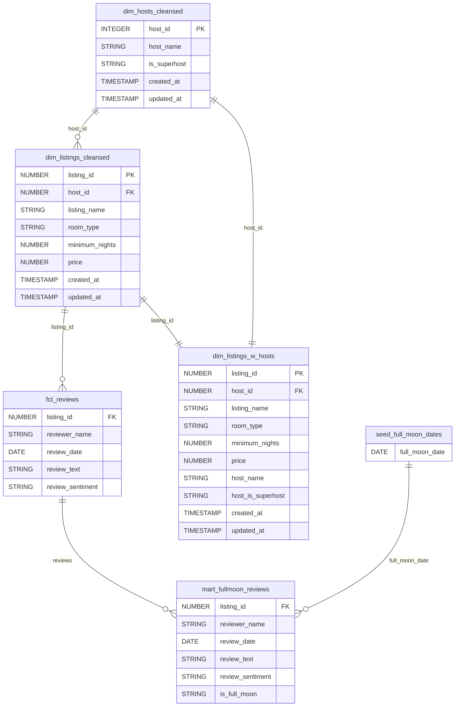
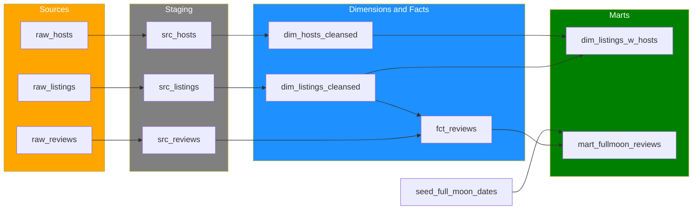

# dbt Airbnb Analytics

An analytics engineering project built with **dbt** on **Snowflake**, transforming raw Airbnb data into clean, tested, and well-documented dimensional models.

## Architecture

```
Raw Sources (Snowflake)          Staging            Dimensions & Facts             Marts
┌──────────────────┐        ┌──────────────┐      ┌───────────────────────┐    ┌─────────────────────┐
│ RAW.RAW_LISTINGS │───────▶│ src_listings  │─────▶│ dim_listings_cleansed │───▶│                     │
│ RAW.RAW_HOSTS    │───────▶│ src_hosts     │─────▶│ dim_hosts_cleansed    │───▶│ dim_listings_w_hosts│
│ RAW.RAW_REVIEWS  │───────▶│ src_reviews   │─────▶│ fct_reviews           │───▶│ mart_fullmoon_reviews│
└──────────────────┘        └──────────────┘      └───────────────────────┘    └─────────────────────┘
                                (ephemeral)           (table / incremental)          (table / view)
```

## Project Structure

```
dbt_airbnb/
├── models/
│   ├── src/                      # Staging layer (ephemeral)
│   │   ├── src_listings.sql
│   │   ├── src_hosts.sql
│   │   └── src_reviews.sql
│   ├── dim/                      # Dimension & fact models
│   │   ├── dim_listings_cleansed.sql
│   │   ├── dim_hosts_cleansed.sql
│   │   └── dim_listings_w_hosts.sql
│   ├── fct/
│   │   └── fct_reviews.sql       # Incremental model
│   ├── mart/
│   │   ├── mart_fullmoon_reviews.sql
│   │   └── unit_tests.yml
│   ├── schema.yml                # Model configs, column docs & tests
│   ├── sources.yml               # Source definitions with freshness
│   └── docs.md                   # Documentation blocks
├── macros/                       # Custom generic tests
│   ├── minimum_row_count.sql
│   ├── positive_values.sql
│   ├── expect_row_count_to_equal_other_table.sql
│   ├── expect_column_values_to_be_of_type.sql
│   ├── expect_column_quantile_values_to_be_between.sql
│   └── expect_column_max_to_be_between.sql
├── seeds/
│   └── seed_full_moon_dates.csv
├── snapshots/                    # SCD Type 2
│   ├── raw_hosts_snapshot.yml
│   └── raw_listings_snapshot.yml
├── tests/                        # Singular tests
│   ├── consistent_created_at.sql
│   └── dim_listings_minimum_nights.sql
├── dbt_project.yml
├── packages.yml
└── profiles.yml
```

## Key Features

| Feature | Details |
|---|---|
| **Incremental Loading** | `fct_reviews` uses incremental materialization with `on_schema_change = 'fail'` |
| **SCD Type 2 Snapshots** | Timestamp-based snapshots on hosts and listings with hard-delete invalidation |
| **Contract Enforcement** | `dim_hosts_cleansed` enforces column contracts (types + constraints) |
| **Source Freshness** | Reviews source configured with warn (1h) / error (24h) freshness checks |
| **Custom Generic Tests** | 6 reusable test macros (row counts, positive values, type checks, quantiles) |
| **Unit Tests** | Full-moon review matcher logic validated with deterministic inputs |

## Test Coverage

**21 tests** across all models:

- **`dim_listings_cleansed`** — unique, not_null, relationships, accepted_values, positive_values, minimum_row_count
- **`dim_hosts_cleansed`** — unique, not_null, accepted_values
- **`dim_listings_w_hosts`** — row count equality, column type, quantile range, max boundary
- **`fct_reviews`** — relationships, not_null, accepted_values
- **Singular tests** — consistent_created_at, dim_listings_minimum_nights

## Getting Started

### Prerequisites

- Snowflake account with a `RAW` schema containing `raw_listings`, `raw_hosts`, `raw_reviews`
- dbt Core installed (`pip install dbt-snowflake`)

### Setup

```bash
# Clone the repo
git clone https://github.com/<your-username>/dbt-airbnb.git
cd dbt-airbnb

# Update profiles.yml with your Snowflake credentials
# Then:
dbt deps
dbt seed
dbt snapshot
dbt run
dbt test
```

### Full Build (seed + snapshot + run + test)

```bash
dbt build
```

## Data Model (ERD)



## Data Lineage


